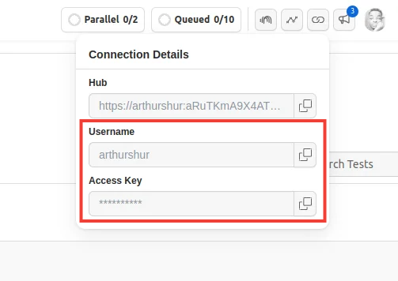
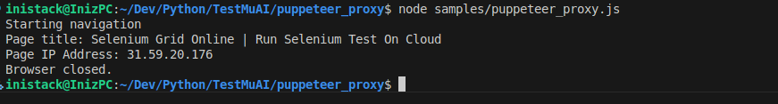
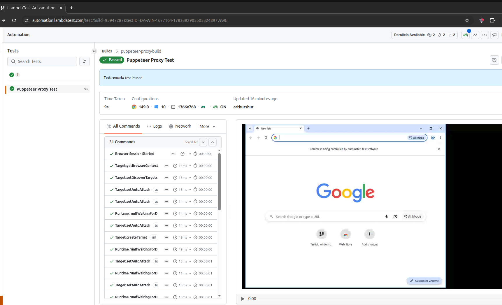

## Use Proxy in Puppeteer

Learn how to use proxy in Puppeteer framework. 
### Setup and Installation
Before you proceed, ensure that you have Node.js (LTS)/latest version and Node Package Manager (npm) installed on your computer.

Step 1: Clone this repository and navigate to the code directory as shown below:
```
    git clone https://github.com/inistack/puppeteer_proxy.git
```
```
    cd puppeteer_proxy
```
Step 2: Install the npm dependencies.
```
    npm install
```
### Authentication
Step 3: In order to run your Puppeteer on TestMu AI (formerly LambdaTest) cloud you will need to set your TestMu AI (formerly LambdaTest) username and access key in the environment variables. Click the Access Key button at the top-right of the Automation Dashboard to access it.



Step 4: Obtain your proxy server URL from your proxy provider and it as an environment variable `PROXY_SERVER` in your `.env` file.
Keep your proxy server details as environment variables to avoid exposing it in a public repo. 

> [!NOTE]
> Replace placeholder values for all environment variables such as `LT_USERNAME`, `LT_ACCESS_KEY`, `PROXY_SERVER`, `PROXY_USERNAME`, and `PROXY_PASSWORD`  with actual values from your TestMu AI account and proxy provider. 

**Windows**
```
    set LT_USERNAME="YOUR_LAMBDATEST_USERNAME"
    set LT_ACCESS_KEY="YOUR_LAMBDATEST_ACCESS_KEY"
    set PROXY_SERVER=”YOUR_PROXY_SERVER”
    set PROXY_USERNAME=”YOUR_PROXY_USERNAME”
    set PROXY_PASSWORD=”YOUR_PROXY_PASSWORD”
```
**Linux/macOS**
```
    export LT_USERNAME="YOUR_LAMBDATEST_USERNAME"
    export LT_ACCESS_KEY="YOUR_LAMBDATEST_ACCESS_KEY"
    export PROXY_SERVER=”YOUR_PROXY_SERVER”
    set PROXY_PASSWORD=”YOUR_PROXY_USERNAME”
    set PROXY_PASSWORD=”YOUR_PROXY_PASSWORD”
```
### Executing The Puppeteer Scripts
To the Puppeteer scripts in this repository on TestMu AI (formerly LambdaTest) cloud plaform. 
Use the following command:
```
    node samples/puppeteer_proxy.js 
```
### View your Puppeteer results
After executing the script, your terminal should show similar results with your proxy IP address:


The TestMu AI (formerly LambdaTest) automation dashboard is where you can see the results of your executed Puppeteer scripts on the LambdaTest platform. It should look like this:

